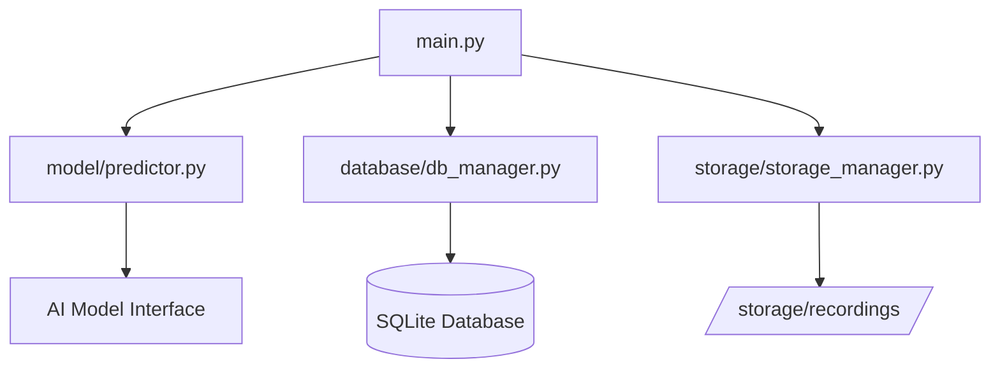

# lingograde
lingo grade, grades your speech, identifies issues, and enhances language skills to become a native speaker.

## Architecture

### Component Overview


### File Structure and Responsibilities

1. **main.py**
   - Main Streamlit application entry point
   - Handles user interface and interaction
   - Coordinates between model, storage, and database components
   - Manages audio recording and playback

2. **model/predictor.py**
   - Contains the AIModel class
   - Handles speech processing and analysis
   - Returns predictions and transcriptions
   - Processes audio data into meaningful results

3. **database/db_manager.py**
   - Manages SQLite database operations
   - Stores recording metadata and results
   - Handles user sessions and recording history
   - Provides CRUD operations for recordings

4. **storage/storage_manager.py**
   - Manages physical file storage
   - Organizes recordings by user ID
   - Handles file saving and retrieval
   - Maintains directory structure

5. **storage/recordings/**
   - Physical storage location for audio files
   - Organized in user-specific directories
   - Contains WAV format audio recordings

### Data Flow
1. User records audio through Streamlit interface
2. Audio is saved via StorageManager
3. Audio is processed by AIModel
4. Results are stored in database via DatabaseManager
5. Results and audio playback are displayed in UI

## Features
### Recording
- Record from microphone
- Record from file
- Record from youtube

### Grading Skills 
Grades in a star graph, provide a prompt to read and analyze your speech.
It will grade your speech and provide a star graph with the grade.
A gauge on the certification level you are at.

#### Speech
- **Pronunciation**: How well you pronounce the words
- **Fluency**: How well you speak fluent, your melody is 
- **Coherence**: How well you speak coherent, your ideas are clear
- **Grammar**: How well you speak grammatically correct
- **Vocabulary**: How diverse your vocabulary is

#### Certification
- **CEFR scale grade**: A scale grade of your English level according to the CEFR scale (A1, A2, B1, B2, C1, C2)
- **IELTS scale grade**: A scale grade of your English level according to the IELTS scale (1-9)

## Goals MVP Challenge
### MVP 1
- Record from microphone
- Grading skills
- Star graph

### MVP 2
- Certification

## Stack
- Python
- Docker
- Streamlit
- Gemma

## Packages
- whisper (audio to text)
- gemma 2 (text to text)
- langchain (chaining models)
- dotenv (env variables)
- ffmpeg (audio processing)
- numpy (audio processing)
- pandas (audio processing)

## Additional Packages
- librosa (advanced audio analysis)
- pyDictionary (vocabulary enhancement)
- spaCy (NLP processing)
- pytest (testing framework)

## Installation

### Option 1: Local Installation
1. Prerequisites:
```bash
# Install Homebrew (if not installed)
/bin/bash -c "$(curl -fsSL https://raw.githubusercontent.com/Homebrew/install/HEAD/install.sh)"

# Install system dependencies
brew install pyenv
brew install ffmpeg
brew install pkg-config  # Required for audio processing
brew install portaudio   # Required for audio recording

# Add pyenv to your shell (for zsh)
echo 'export PYENV_ROOT="$HOME/.pyenv"' >> ~/.zshrc
echo '[[ -d $PYENV_ROOT/bin ]] && export PATH="$PYENV_ROOT/bin:$PATH"' >> ~/.zshrc
echo 'eval "$(pyenv init -)"' >> ~/.zshrc
source ~/.zshrc

# Install Python 3.11.7
pyenv install 3.11.7

# Set local Python version
pyenv local 3.11.7
```

2. Clone and setup:
```bash
# Clone repository
git clone https://github.com/skippyhub/lingograde.git
cd lingograde

# Install dependencies
make install
```

### Option 2: Using Docker
```bash
# Install Docker (macOS)
brew install --cask docker

# Start Docker Desktop
open -a Docker

# Build and run
docker build -t lingograde .
docker run -p 8501:8501 lingograde
```

## Usage

### Local Usage
1. Run the application:
```bash
make run
```

2. Run tests:
```bash
make test
```

3. Format code:
```bash
make lint
```

4. Clean up:
```bash
make clean
```

### Docker Usage
```bash
# Run existing container
docker start lingograde

# Stop container
docker stop lingograde

# View logs
docker logs lingograde

# Rebuild after changes
docker build -t lingograde .
docker run -p 8501:8501 lingograde
```

Access the application at http://localhost:8501

## Development

See [CONTRIBUTING.md](CONTRIBUTING.md) for detailed development guidelines.

## Deployment

### Docker
```bash
docker build -t lingograde .
docker run -p 8501:8501 lingograde
```


